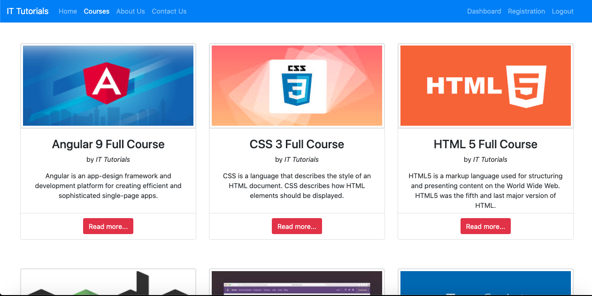
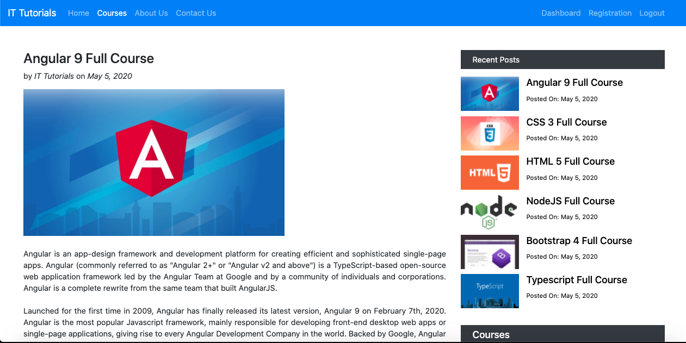
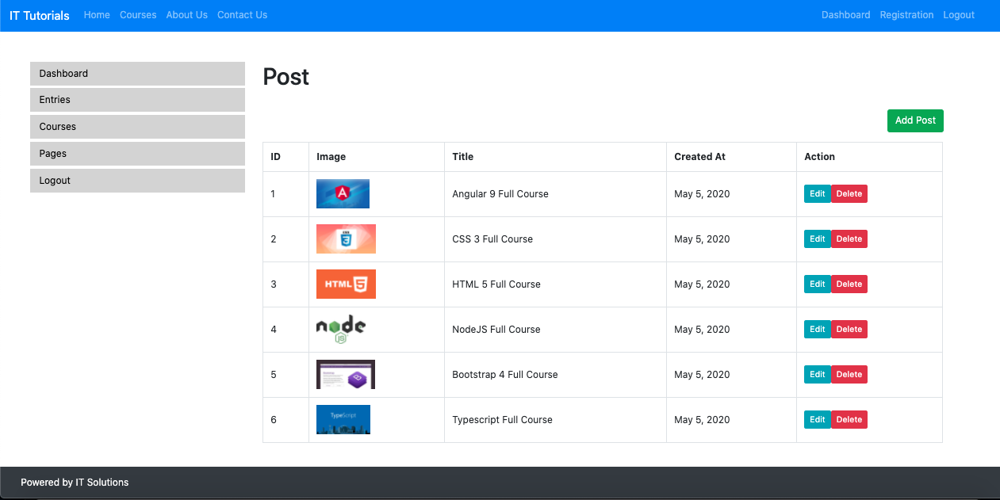
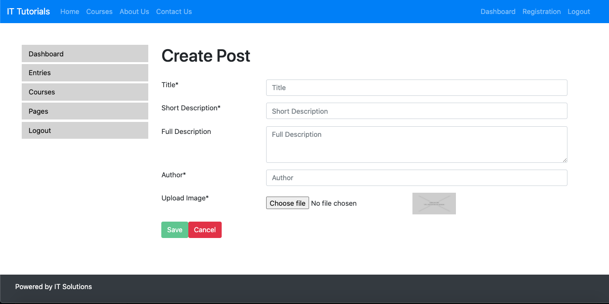

<h1>IT Tutorial</h1>

It is a IT tutorial website made in MEAN stack with dynamic courses content. Admin users can sign-in and upload new courses content or edit/delete any of the existing course content. Once logged-in, admin user can register other admin users.

<h1>Front-End</h1>
<ul>
    <li>The code is divided into different modules and components for better scalability and readability.</li>
    <li>Modules created - Root Module, AdminModule, AuthModule, CoursesModule, StaticPagesModule</li>
    <li>Root Module components - AppComponent, BannerComponent, HeaderComponent, FooterComponent, PageNotFoundComponent</li>
    <li>AdminModule components - DashboardComponent, EntriesComponent</li>
    <li>AuthModule components - RegistrationComponent, LoginComponent</li>
    <li>CoursesModule components - CourseFeaturedComponent, CourseListComponent, CourseDetailComponent, CourseRecentComponent, CourseCategoriesComponent</li>
    <li>StaticPagesModule components - PagesComponent, ContactUsComponent</li>
</ul>

<h1>Back-End</h1>
<ul>
    <li>Models created in MongoDB database - Employee, Entry</li>
    <li>Employee model to store all the admin user registration details</li>
    <li>Entry model to store all the different course content details</li>
    <li>Various REST APIs created using these models for CRUD operations</li>
</ul>

<h1>Technologies Used</h1>
<ul>
    <li>Angular</li>
    <li>NodeJS</li>
    <li>ExpressJS</li>
    <li>MongoDB</li>
    <li>Bootstrap</li>
</ul>

<h1>Screenshots</h1>

